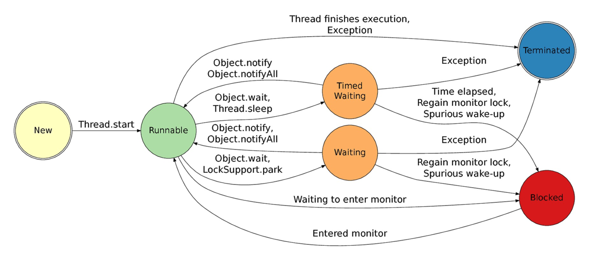

# 多线程

考：

[/www.jianshu.com/p/40d4c7aebd66](https://github.com/lozvx/lozvx-book/tree/d8fcb28607b2fe17707d1cc1946caf37bd1ccf5f/www.jianshu.com/p/40d4c7aebd66/README.md)

[/blog.csdn.net/evankaka/article/details/44153709](https://github.com/lozvx/lozvx-book/tree/d8fcb28607b2fe17707d1cc1946caf37bd1ccf5f/blog.csdn.net/evankaka/article/details/44153709/README.md)

[/blog.csdn.net/column/details/javahhighconcurrence.html](https://github.com/lozvx/lozvx-book/tree/d8fcb28607b2fe17707d1cc1946caf37bd1ccf5f/blog.csdn.net/column/details/javahhighconcurrence.html)

线程状态：

* New（新生）
* Runnable（可运行）
* Blocked（被阻塞）
* Waiting（等待）
* Timed waiting（计时等待）
* Terminated（被终止）

**实现Runnable接口比继承Thread类所具有的优势：**

**1）：适合多个相同的程序代码的线程去处理同一个资源**

**2）：可以避免java中的单继承的限制**

**3）：增加程序的健壮性，代码可以被多个线程共享，代码和数据独立**

**4）：线程池只能放入实现Runable或callable类线程，不能直接放入继承Thread的类**

## 线程调度

1. 调整线程优先级：Java线程有优先级，优先级高的线程会获得较多的运行机会。
2. 线程睡眠：Thread.sleep\(long millis\)方法，使线程转到阻塞状态。millis参数设定睡眠的时间，以毫秒为单位。当睡眠结束后，就转为就绪（Runnable）状态。sleep\(\)平台移植性好。
3. 线程等待：Object类中的wait\(\)方法，导致当前的线程等待，直到其他线程调用此对象的 notify\(\) 方法或 notifyAll\(\) 唤醒方法。这个两个唤醒方法也是Object类中的方法，行为等价于调用 wait\(0\) 一样。
4. 线程让步：Thread.yield\(\) 方法，暂停当前正在执行的线程对象，把执行机会让给相同或者更高优先级的线程。
5. 线程加入：join\(\)方法，等待其他线程终止。在当前线程中调用另一个线程的join\(\)方法，则当前线程转入阻塞状态，直到另一个进程运行结束，当前线程再由阻塞转为就绪状态。
6. 线程唤醒：Object类中的notify\(\)方法，唤醒在此对象监视器上等待的单个线程。如果所有线程都在此对象上等待，则会选择唤醒其中一个线程。选择是任意性的，并在对实现做出决定时发生。线程通过调用其中一个 wait 方法，在对象的监视器上等待。 直到当前的线程放弃此对象上的锁定，才能继续执行被唤醒的线程。被唤醒的线程将以常规方式与在该对象上主动同步的其他所有线程进行竞争；例如，唤醒的线程在作为锁定此对象的下一个线程方面没有可靠的特权或劣势。类似的方法还有一个notifyAll\(\)，唤醒在此对象监视器上等待的所有线程。
7. Thread.sleep: 指定的毫秒数内让当前正在执行的线程休眠，不释放锁。
8. Thread.join：让主线程等待子线程执行结束后再结束。
9. Thread.yield：暂停当前正在执行的线程，并执行其他线程。 让当前线程回到可运行状态，以允许具有相同优先级的线程获得运行机会。
10. Object.wait,Object.notify

从功能上来说wait就是说线程在获取对象锁后，主动释放对象锁，同时本线程休眠。直到有其它线程调用对象的notify\(\)唤醒该线程，才能继续获取对象锁，并继续执行。相应的notify\(\)就是对对象锁的唤醒操作。但有一点需要注意的是notify\(\)调用后，并不是马上就释放对象锁的，而是在相应的synchronized\(\){}语句块执行结束，自动释放锁后，JVM会在wait\(\)对象锁的线程中随机选取一线程，赋予其对象锁，唤醒线程，继续执行。

**sleep（）方法**

sleep\(\)使当前线程进入停滞状态（阻塞当前线程），让出CUP的使用、目的是不让当前线程独自霸占该进程所获的CPU资源，以留一定时间给其他线程执行的机会;

sleep\(\)是Thread类的Static\(静态\)的方法；因此他不能改变对象的机锁，所以当在一个Synchronized块中调用Sleep\(\)方法是，线程虽然休眠了，但是对象的机锁并木有被释放，其他线程无法访问这个对象（即使睡着也持有对象锁）。

在sleep\(\)休眠时间期满后，该线程不一定会立即执行，这是因为其它线程可能正在运行而且没有被调度为放弃执行，除非此线程具有更高的优先级。

**wait（）方法**

wait\(\)方法是Object类里的方法；当一个线程执行到wait\(\)方法时，它就进入到一个和该对象相关的等待池中，同时失去（释放）了对象的机锁（暂时失去机锁，wait\(long timeout\)超时时间到后还需要返还对象锁）；其他线程可以访问；

wait\(\)使用notify或者notifyAlll或者指定睡眠时间来唤醒当前等待池中的线程。

wiat\(\)必须放在synchronized block中，否则会在program runtime时扔出”java.lang.IllegalMonitorStateException“异常

