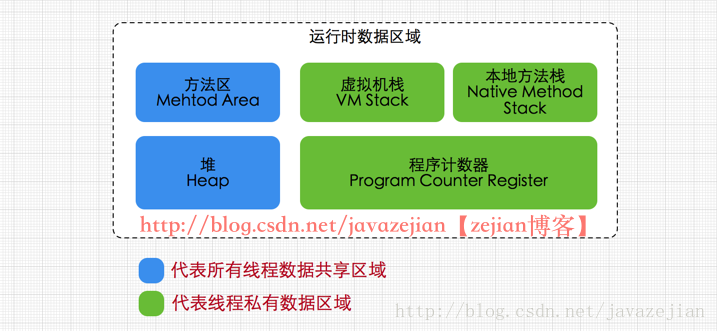

# 全面理解Java内存模型\(JMM\)及volatile关键字

参考：[http://blog.csdn.net/javazejian/article/details/72772461](http://blog.csdn.net/javazejian/article/details/72772461)

* 方法区（Method Area）： 方法区属于线程共享的内存区域，又称Non-Heap（非堆），主要用于存储已被虚拟机加载的类信息、常量、静态变量、即时编译器编译后的代码等数据，根据Java 虚拟机规范的规定，当方法区无法满足内存分配需求时，将抛出OutOfMemoryError 异常。值得注意的是在方法区中存在一个叫运行时常量池\(Runtime Constant Pool）的区域，它主要用于存放编译器生成的各种字面量和符号引用，这些内容将在类加载后存放到运行时常量池中，以便后续使用。
* JVM堆（Java Heap）：

  Java 堆也是属于线程共享的内存区域，它在虚拟机启动时创建，是Java 虚拟机所管理的内存中最大的一块，主要用于存放对象实例，几乎所有的对象实例都在这里分配内存，注意Java 堆是垃圾收集器管理的主要区域，因此很多时候也被称做GC 堆，如果在堆中没有内存完成实例分配，并且堆也无法再扩展时，将会抛出OutOfMemoryError 异常。

* 程序计数器\(Program Counter Register\)：

  属于线程私有的数据区域，是一小块内存空间，主要代表当前线程所执行的字节码行号指示器。字节码解释器工作时，通过改变这个计数器的值来选取下一条需要执行的字节码指令，分支、循环、跳转、异常处理、线程恢复等基础功能都需要依赖这个计数器来完成。

* 虚拟机栈\(Java Virtual Machine Stacks\)：

  属于线程私有的数据区域，与线程同时创建，总数与线程关联，代表Java方法执行的内存模型。每个方法执行时都会创建一个栈桢来存储方法的的变量表、操作数栈、动态链接方法、返回值、返回地址等信息。每个方法从调用直结束就对于一个栈桢在虚拟机栈中的入栈和出栈过程

* 本地方法栈\(Native Method Stacks\)：

  本地方法栈属于线程私有的数据区域，这部分主要与虚拟机用到的 Native 方法相关，一般情况下，我们无需关心此区域。

## volatile内存语义 

volatile在并发编程中很常见，但也容易被滥用，现在我们就进一步分析volatile关键字的语义。volatile是Java虚拟机提供的轻量级的同步机制。volatile关键字有如下两个作用

* 保证被volatile修饰的共享gong’x变量对所有线程总数可见的，也就是当一个线程修改了一个被volatile修饰共享变量的值，新值总数可以被其他线程立即得知。
* 禁止指令重排序优化。

