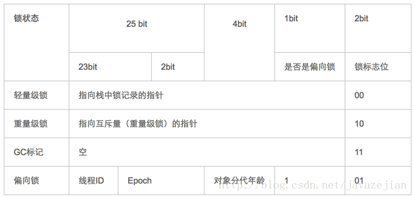

# synchronized

参考：

[http://blog.csdn.net/javazejian/article/details/72828483](http://blog.csdn.net/javazejian/article/details/72828483)

### synchronized的三种应用方式

* 修饰实例方法，作用于当前实例加锁，进入同步代码前要获得当前实例的锁
* 修饰静态方法，作用于当前类对象加锁，进入同步代码前要获得当前类对象的锁
* 修饰代码块，指定加锁对象，对给定对象加锁，进入同步代码库前要获得给定对象的锁。

synchronized：可重入锁；

java.util.concurrent.locks.ReentrantLock：可重入锁；

从互斥锁的设计上来说，当一个线程试图操作一个由其他线程持有的对象锁的临界资源时，将会处于阻塞状态，但当一个线程再次请求自己持有对象锁的临界资源时，这种情况属于重入锁，请求将会成功，在java中synchronized是基于原子性的内部锁机制，是可重入的，因此在一个线程调用synchronized方法的同时在其方法体内部调用该对象另一个synchronized方法，也就是说一个线程得到一个对象锁后再次请求该对象锁，是允许的，这就是synchronized的可重入性。

```text
public class AccountingSync implements Runnable{
    static AccountingSync instance=new AccountingSync();
    static int i=0;
    static int j=0;
    @Override
    public void run() {
        for(int j=0;j<1000000;j++){

            //this,当前实例对象锁
            synchronized(this){
                i++;
                increase();//synchronized的可重入性
            }
        }
    }

    public synchronized void increase(){
        j++;
    }


    public static void main(String[] args) throws InterruptedException {
        Thread t1=new Thread(instance);
        Thread t2=new Thread(instance);
        t1.start();t2.start();
        t1.join();t2.join();
        System.out.println(i);
    }
}
```



其中轻量级锁和偏向锁是Java 6 对 synchronized 锁进行优化后新增加的，稍后我们会简要分析。这里我们主要分析一下重量级锁也就是通常说synchronized的对象锁，锁标识位为10，其中指针指向的是monitor对象（也称为管程或监视器锁）的起始地址。每个对象都存在着一个 monitor 与之关联，对象与其 monitor 之间的关系有存在多种实现方式，如monitor可以与对象一起创建销毁或当线程试图获取对象锁时自动生成，但当一个 monitor 被某个线程持有后，它便处于锁定状态。

## 等待唤醒机制与synchronized {#等待唤醒机制与synchronized}

谓等待唤醒机制本篇主要指的是notify/notifyAll和wait方法，在使用这3个方法时，必须处于synchronized代码块或者synchronized方法中，否则就会抛出IllegalMonitorStateException异常，这是因为调用这几个方法前必须拿到当前对象的监视器monitor对象，也就是说notify/notifyAll和wait方法依赖于monitor对象，在前面的分析中，我们知道monitor 存在于对象头的Mark Word 中\(存储monitor引用指针\)，而synchronized关键字可以获取 monitor ，这也就是为什么notify/notifyAll和wait方法必须在synchronized代码块或者synchronized方法调用的原因。

```text
synchronized (obj) {
       obj.wait();
       obj.notify();
       obj.notifyAll();         
 }
```

