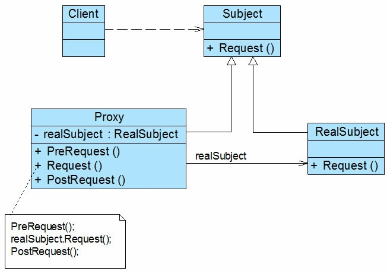

# 代理模式-Proxy Pattern

代理模式是一种对象结构型模式。在代理模式中引入了一个新的代理对象,代理对象在客户端对象和目标对象之间起到中介的作用,它去掉客户不能看到的内容和服务或者增添客户需要的额外的新服务。

* Subject\(抽象主题角色\):它声明了真实主题和代理主题的共同接口,这样一来在任何使用真实主题的地方都可以使用代理主题,客户端通常需要针对抽象主题角色进行编程。
* Proxy\(代理主题角色\):它包含了对真实主题的引用,从而可以在任何时候操作真实主题对象;在代理主题角色中提供一个与真实主题角色相同的接口,以便在任何时候都可以替代真实主题;代理主题角色还可以控制对真实主题的使用,负责在需要的时候创建和删除真实主题对象,并对真实主题对象的使用加以约束。通常,在代理主题角色中,客户端在调用所引用的真实主题操作之前或之后还需要执行其他操作,而不仅仅是单纯调用真实主题对象中的操作。
* RealSubject\(真实主题角色\):它定义了代理角色所代表的真实对象,在真实主题角色中实现了真实的业务操作,客户端可以通过代理主题角色间接调用真实主题角色中定义的操作。

