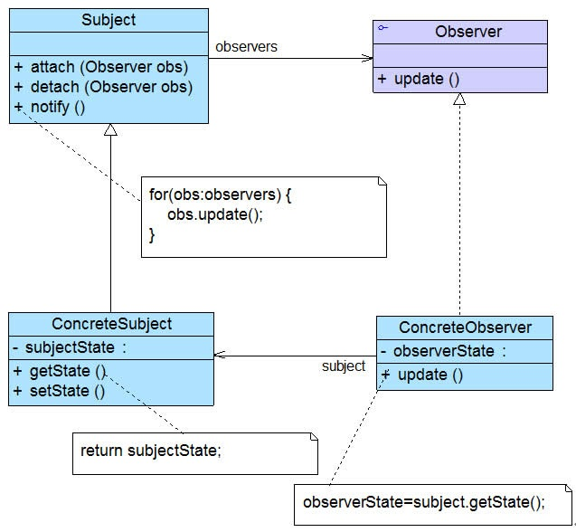
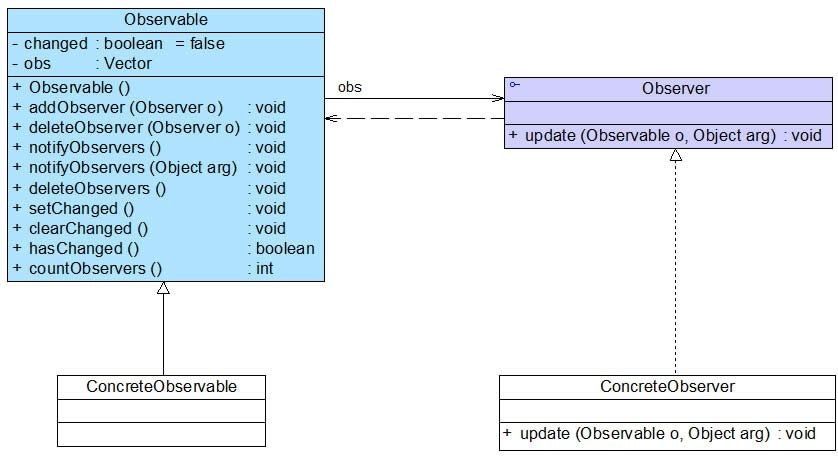

# 观察者模式-Observer Pattern

观察者模式是使用频率最高的设计模式之一,它用于建立一种对象与对象之间的依赖关系,一个对象发生改变时将自动通知其他对象,其他对象将相应作出反应。在观察者模式中,发生改变的对象称为观察目标,而被通知的对象称为观察者,一个观察目标可以对应多个观察者,而且这些观察者之间可以没有任何相互联系,可以根据需要增加和删除观察者,使得系统更易于扩展。

观察者模式定义如下: 观察者模式\(Observer Pattern\):定义对象之间的一种一对多依赖关系,使得每当一个对象状态发生改变时,其相关依赖对象皆得到通知并被自动更新。观察者模式的别名包括发布-订阅\(Publish/Subscribe\)模式、模型-视图\(Model/View\)模式、源-监听器\(Source/Listener\)模式或从属者\(Dependents\)模式。观察者模式是一种对象行为型模式。

* Subject\(目标\):目标又称为主题,它是指被观察的对象。在目标中定义了一个观察者集合,一个观察目标可以接受任意数量的观察者来观察,它提供一系列方法来增加和删除观察者对象,同时它定义了通知方法notify\(\)。目标类可以是接口,也可以是抽象类或具体类。
* ConcreteSubject\(具体目标\):具体目标是目标类的子类,通常它包含有经常发生改变的数据,当它的状态发生改变时,向它的各个观察者发出通知;同时它还实现了在目标类中定义的抽象业务逻辑方法\(如果有的话\)。如果无须扩展目标类,则具体目标类可以省略。
* Observer\(观察者\):观察者将对观察目标的改变做出反应,观察者一般定义为接口,该接口声明了更新数据的方法update\(\),因此又称为抽象观察者。
* ConcreteObserver\(具体观察者\):在具体观察者中维护一个指向具体目标对象的引用,它存储具体观察者的有关状态,这些状态需要和具体目标的状态保持一致;它实现了在抽象观察者Observer中定义的update\(\)方法。通常在实现时,可以调用具体目标类的attach\(\)方法将自己添加到目标类的集合中或通过detach\(\)方法将自己从目标类的集合中删除。

观察者模式在Java语言中的地位非常重要。在JDK的java.util包中,提供了Observable类以及Observer接口,它们构成了JDK对观察者模式的支持

