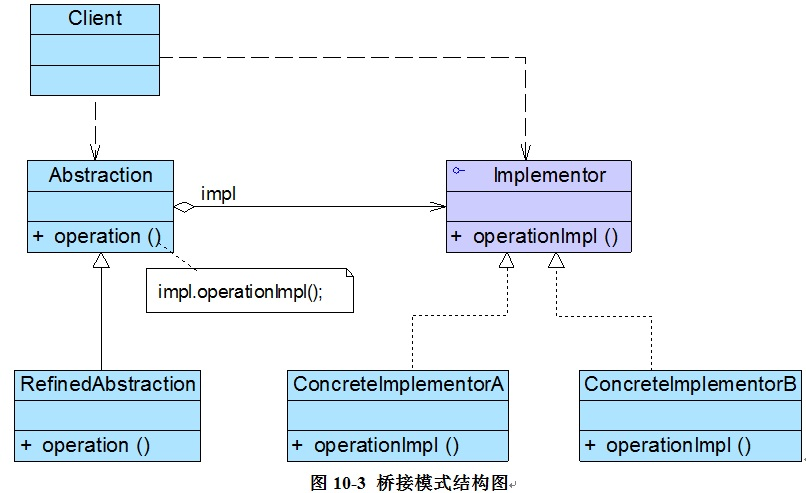

# 桥接模式-Bridge Pattern

桥接模式\(Bridge Pattern\):将抽象部分与它的实现部分分离,使它们都可以独立地变化。它是一种对象结构型模式,又称为柄体\(Handle and Body\)模式或接口\(Interface\)模式。

* Abstraction\(抽象类\):用于定义抽象类的接口,它一般是抽象类而不是接口,其中定义了一个Implementor\(实现类接口\)类型的对象并可以维护该对象,它与Implementor之间具有关联关系,它既可以包含抽象业务方法,也可以包含具体业务方法。
* RefinedAbstraction\(扩充抽象类\):扩充由Abstraction定义的接口,通常情况下它不再是抽象类而是具体类,它实现了在Abstraction中声明的抽象业务方法,在RefinedAbstraction中可以调用在Implementor中定义的业务方法。
* Implementor\(实现类接口\):定义实现类的接口,这个接口不一定要与Abstraction的接口完全一致,事实上这两个接口可以完全不同,一般而言,Implementor接口仅提供基本操作,而Abstraction定义的接口可能会做更多更复杂的操作。Implementor接口对这些基本操作进行了声明,而具体实现交给其子类。通过关联关系,在Abstraction中不仅拥有自己的方法,还可以调用到Implementor中定义的方法,使用关联关系来替代继承关系。
* ConcreteImplementor\(具体实现类\):具体实现Implementor接口,在不同的ConcreteImplementor中提供基本操作的不同实现,在程序运行时,ConcreteImplementor对象将替换其父类对象,提供给抽象类具体的业务操作方法。

