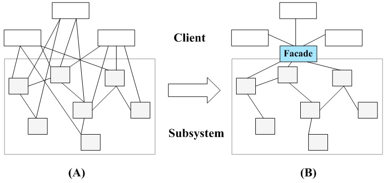
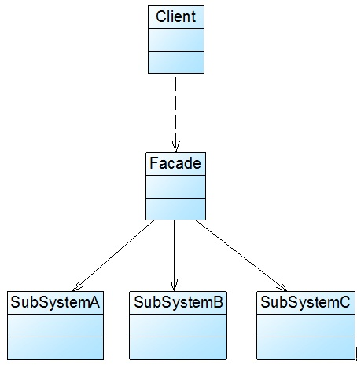

# 外观模式 Facade Pattern

外观模式中,一个子系统的外部与其内部的通信通过一个统一的外观类进行,外观类将客户类与子系统的内部复杂性分隔开,使得客户类只需要与外观角色打交道,而不需要与子系统内部的很多对象打交道。

外观模式定义如下: 外观模式（Facade Pattern）:为子系统中的一组接口提供一个统一的入口。外观模式定义了一个高层接口,这个接口使得这一子系统更加容易使用。



* Facade\(外观角色\):在客户端可以调用它的方法,在外观角色中可以知道相关的\(一个或者多个\)子系统的功能和责任;在正常情况下,它将所有从客户端发来的请求委派到相应的子系统去,传递给相应的子系统对象处理。
* SubSystem\(子系统角色\):在软件系统中可以有一个或者多个子系统角色,每一个子系统可以不是一个单独的类,而是一个类的集合,它实现子系统的功能;每一个子系统都可以被客户端直接调用,或者被外观角色调用,它处理由外观类传过来的请求;子系统并不知道外观的存在,对于子系统而言,外观角色仅仅是另外一个客户端而已。

```text
package designpattern.facade;

public class Facade {
    private SubSystemA subSystemA = new SubSystemA();
    private SubSystemB subSystemB = new SubSystemB();

    public void method() {
        subSystemA.methodA();
        subSystemB.methodB();
    }
}
```

