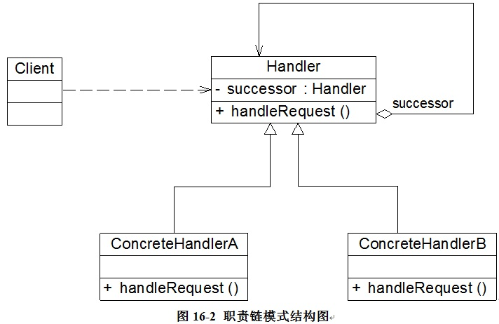

# 职责链模式-Chain of Responsibility Pattern

职责链可以是一条直线、一个环或者一个树形结构,最常见的职责链是直线型,即沿着一条单向的链来传递请求。链上的每一个对象都是请求处理者,职责链模式可以将请求的处理者组织成一条链,并让请求沿着链传递,由链上的处理者对请求进行相应的处理,客户端无须关心请求的处理细节以及请求的传递,只需将请求发送到链上即可,实现请求发送者和请求处理者解耦。

职责链模式定义如下: 职责链模式\(Chain of Responsibility Pattern\):避免请求发送者与接收者耦合在一起,让多个对象都有可能接收请求,将这些对象连接成一条链,并且沿着这条链传递请求,直到有对象处理它为止。职责链模式是一种对象行为型模式。

* Handler\(抽象处理者\):它定义了一个处理请求的接口,一般设计为抽象类,由于不同的具体处理者处理请求的方式不同,因此在其中定义了抽象请求处理方法。因为每一个处理者的下家还是一个处理者,因此在抽象处理者中定义了一个抽象处理者类型的对象\(如结构图中的successor\),作为其对下家的引用。通过该引用,处理者可以连成一条链。
* ConcreteHandler\(具体处理者\):它是抽象处理者的子类,可以处理用户请求,在具体处理者类中实现了抽象处理者中定义的抽象请求处理方法,在处理请求之前需要进行判断,看是否有相应的处理权限,如果可以处理请求就处理它,否则将请求转发给后继者;在具体处理者中可以访问链中下一个对象,以便请求的转发。

在职责链模式里,**很多对象由每一个对象对其下家的引用而连接起来形成一条链**。请求在这个链上传递,直到链上的某一个对象决定处理此请求。发出这个请求的客户端并不知道链上的哪一个对象最终处理这个请求,这使得系统可以在不影响客户端的情况下动态地重新组织链和分配责任。

