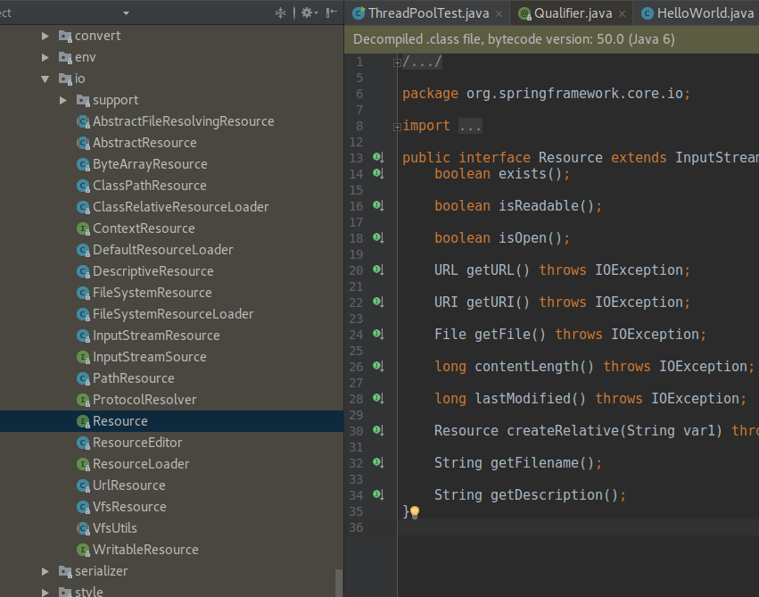

# Resources

Spring Resource

```java
public interface Resource extends InputStreamSource {

    boolean exists();

    boolean isOpen();

    URL getURL() throws IOException;

    File getFile() throws IOException;

    Resource createRelative(String relativePath) throws IOException;

    String getFilename();

    String getDescription();

}

public interface InputStreamSource {

    InputStream getInputStream() throws IOException;

}
```

Resource的实现：

ResourceLoader

```text
public interface ResourceLoader {

    Resource getResource(String location);

}
```

需要实现并返回Resource，如`ClassPathXmlApplicationContext`

```text
Resource template = ctx.getResource("some/resource/path/myTemplate.txt");
```

| Prefix | Example | Explanation |
| :--- | :--- | :--- |
| classpath: | `classpath:com/myapp/config.xml` | Loaded from the classpath. |
| file: | [`file:///data/config.xml`](file:///data/config.xml) | Loaded as a `URL`, from the filesystem. \[[3](https://docs.spring.io/spring/docs/5.0.2.RELEASE/spring-framework-reference/core.html#_footnote_3)\] |
| http: | [`http://myserver/logo.png`](http://myserver/logo.png) | Loaded as a `URL`. |
| \(none\) | `/data/config.xml` | Depends on the underlying `ApplicationContext`. |

Resource作为依赖

如果没有写前缀，ApplicationContext 会自动选择Loader，ClassPathResource, FileSystemResource, or ServletContextResource

```text
<bean id="myBean" class="...">
    <property name="template" value="some/resource/path/myTemplate.txt"/>
</bean>
```

也可以强制选择Loader

```text
<property name="template" value="classpath:some/resource/path/myTemplate.txt">
```

`ClassPathXmlApplicationContext：`

```text
ApplicationContext ctx = new ClassPathXmlApplicationContext("conf/appContext.xml");
```

`FileSystemXmlApplicationContext：`

```text
ApplicationContext ctx =
    new FileSystemXmlApplicationContext("conf/appContext.xml");
```

`FileSystemXmlApplicationContext：`

```text
ApplicationContext ctx =
    new FileSystemXmlApplicationContext("classpath:conf/appContext.xml");
```

```text
ApplicationContext ctx = new ClassPathXmlApplicationContext(
    new String[] {"services.xml", "daos.xml"}, MessengerService.class);
```

