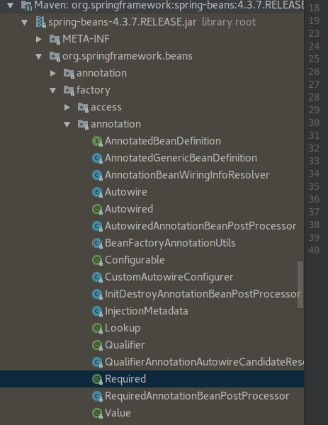

# Annotation-based container configuration

基于注解的容器配置



* @Required

这个注解是加在setter方法上的。检查这个属性在配置阶段有没有填充。如果没有填充就会抛异常。

```text
public class SimpleMovieLister {

    private MovieFinder movieFinder;

    @Required
    public void setMovieFinder(MovieFinder movieFinder) {
        this.movieFinder = movieFinder;
    }

    // ...
}
```

* @Autowired

Autowired能够注解在构造器，setter方法，普通方法，域

构造器：

```text
public class MovieRecommender {

    private final CustomerPreferenceDao customerPreferenceDao;

    @Autowired
    public MovieRecommender(CustomerPreferenceDao customerPreferenceDao) {
        this.customerPreferenceDao = customerPreferenceDao;
    }

    // ...
}
```

Setter方法：

```text
public class SimpleMovieLister {

    private MovieFinder movieFinder;

    @Autowired
    public void setMovieFinder(MovieFinder movieFinder) {
        this.movieFinder = movieFinder;
    }

    // ...
}
```

普通方法：

```text
public class MovieRecommender {

    private MovieCatalog movieCatalog;

    private CustomerPreferenceDao customerPreferenceDao;

    @Autowired
    public void prepare(MovieCatalog movieCatalog,
            CustomerPreferenceDao customerPreferenceDao) {
        this.movieCatalog = movieCatalog;
        this.customerPreferenceDao = customerPreferenceDao;
    }

    // ...
}
```

域：

```text
public class MovieRecommender {

    private final CustomerPreferenceDao customerPreferenceDao;

    @Autowired
    private MovieCatalog movieCatalog;

    @Autowired
    public MovieRecommender(CustomerPreferenceDao customerPreferenceDao) {
        this.customerPreferenceDao = customerPreferenceDao;
    }

    // ...
}
```

* @Primary

因为根据类型自动织入，可能会有多个实例。这时候如果有一个注解了Primary，就会自动选择这个注入。

下面这个例子就会注入firstMovieCatalog

```text
@Configuration
public class MovieConfiguration {

    @Bean
    @Primary
    public MovieCatalog firstMovieCatalog() { ... }

    @Bean
    public MovieCatalog secondMovieCatalog() { ... }

    // ...
}
```

```text
public class MovieRecommender {

    @Autowired
    private MovieCatalog movieCatalog;

    // ...
}
```

* @Qualifier

如果自动织入发现有多个Bean，也可以用Qualifier里的value指定Bean的id

```text
public class MovieRecommender {

    @Autowired
    @Qualifier("main")
    private MovieCatalog movieCatalog;

    // ...
}
```

```text
public class MovieRecommender {

    private MovieCatalog movieCatalog;

    private CustomerPreferenceDao customerPreferenceDao;

    @Autowired
    public void prepare(@Qualifier("main")MovieCatalog movieCatalog,
            CustomerPreferenceDao customerPreferenceDao) {
        this.movieCatalog = movieCatalog;
        this.customerPreferenceDao = customerPreferenceDao;
    }

    // ...
}
```

* @Resource

JSR-250

[/wiki.jikexueyuan.com/project/spring/annotation-based-configuration/spring-jsr250-annotation.html](https://github.com/lozvx/lozvx-book/tree/d8fcb28607b2fe17707d1cc1946caf37bd1ccf5f/wiki.jikexueyuan.com/project/spring/annotation-based-configuration/spring-jsr250-annotation.html)

根据name执行自动装配，就使用@Resource注解，而不应该使用@Autowired与@Qualifier的组合。

```text
public class SimpleMovieLister {

    private MovieFinder movieFinder;

    @Resource(name="myMovieFinder")
    public void setMovieFinder(MovieFinder movieFinder) {
        this.movieFinder = movieFinder;
    }
}
```

如果没有指定名字，则默认用属性的名字。

```text
public class SimpleMovieLister {

    private MovieFinder movieFinder;

    @Resource
    public void setMovieFinder(MovieFinder movieFinder) {
        this.movieFinder = movieFinder;
    }
}
```

```text
public class MovieRecommender {

    @Resource
    private CustomerPreferenceDao customerPreferenceDao;

    @Resource
    private ApplicationContext context;

    public MovieRecommender() {
    }

    // ...
}
```

@PostConstruct @PreDestroy

```text
package com.desmond.demo.annotation;

import org.springframework.stereotype.Component;

import javax.annotation.PostConstruct;
import javax.annotation.PreDestroy;

@Component
public class HelloWorld {
    private String message;

    public void setMessage(String message) {
        this.message = message;
    }

    public String getMessage() {
        System.out.println("Your Message : " + message);
        return message;
    }

    @PostConstruct
    public void init() {
        System.out.println("Bean is going through init.");
    }

    @PreDestroy
    public void destroy() {
        System.out.println("Bean will destroy now.");
    }
}
```

```text
@Configuration
@ComponentScan(basePackages = "org.example")
public class AppConfig  {
    ...
}
```

