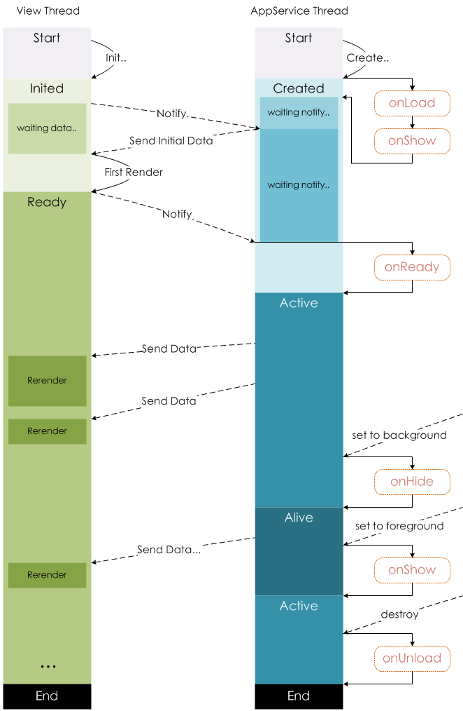

# 逻辑层

App\(\)函数注册一个小程序。

```text
const openIdUrl = require('./config').openIdUrl

App({
  onLaunch: function () {
    console.log('App Launch')
  },
  onShow: function () {
    console.log('App Show')
  },
  onHide: function () {
    console.log('App Hide')
  },
  globalData: {
    hasLogin: false,
    openid: null
  },
  // lazy loading openid
  getUserOpenId: function(callback) {
    var self = this

    if (self.globalData.openid) {
      callback(null, self.globalData.openid)
    } else {
      wx.login({
        success: function(data) {
          wx.request({
            url: openIdUrl,
            data: {
              code: data.code
            },
            success: function(res) {
              console.log('拉取openid成功', res)
              self.globalData.openid = res.data.openid
              callback(null, self.globalData.openid)
            },
            fail: function(res) {
              console.log('拉取用户openid失败，将无法正常使用开放接口等服务', res)
              callback(res)
            }
          })
        },
        fail: function(err) {
          console.log('wx.login 接口调用失败，将无法正常使用开放接口等服务', err)
          callback(err)
        }
      })
    }
  }
})
```

Page\(\)函数注册一个页面。

```text
//index.js
Page({
  data: {
    text: "This is page data."
  },
  onLoad: function(options) {
    // Do some initialize when page load.
  },
  onReady: function() {
    // Do something when page ready.
  },
  onShow: function() {
    // Do something when page show.
  },
  onHide: function() {
    // Do something when page hide.
  },
  onUnload: function() {
    // Do something when page close.
  },
  onPullDownRefresh: function() {
    // Do something when pull down.
  },
  onReachBottom: function() {
    // Do something when page reach bottom.
  },
  onShareAppMessage: function () {
   // return custom share data when user share.
  },
  onPageScroll: function() {
    // Do something when page scroll
  },
  onTabItemTap(item) {
    console.log(item.index)
    console.log(item.pagePath)
    console.log(item.text)
  },
  // Event handler.
  viewTap: function() {
    this.setData({
      text: 'Set some data for updating view.'
    }, function() {
      // this is setData callback
    })
  },
  customData: {
    hi: 'MINA'
  }
})
```

Page实例生命周期：



## 页面路由

以桟的形式维护当前所有的页面。

| 初始化 | 新页面入栈 |
| :--- | :--- |
| 打开新页面 | 新页面入栈 |
| 页面重定向 | 当前页面出栈，新页面入栈 |
| 页面返回 | 页面不断出栈，直到目标返回页，新页面入栈 |
| Tab 切换 | 页面全部出栈，只留下新的 Tab 页面 |
| 重加载 | 页面全部出栈，只留下新的页面 |

